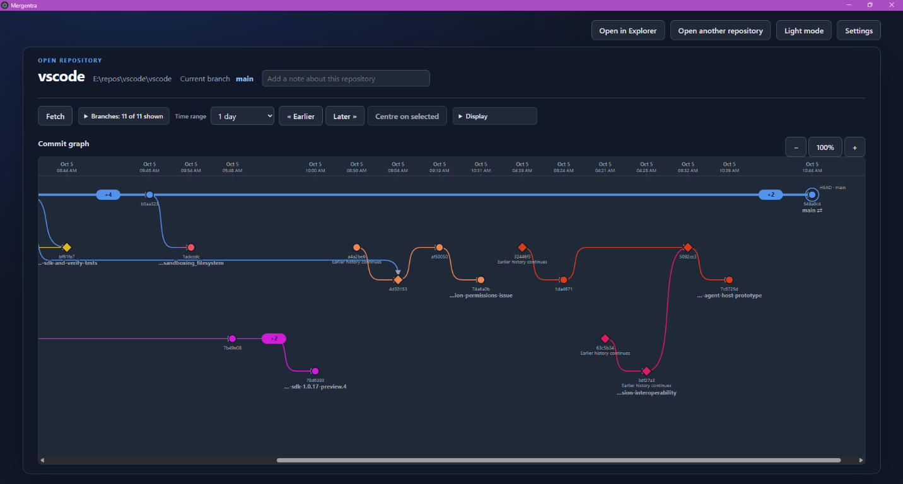

# Mergentra

Mergentra is a Windows-first Electron app for exploring the history of one local Git repository at a time as a branch graph. It is read-only: it never commits, checks out, merges, or edits your repository. The only command that changes repository data is the explicit **Fetch** button, which updates remote-tracking references.

## Screenshot



## Status

Mergentra is **pre-1.0 (version 0.9.0)** and is being made public. Expect rough edges and changes between releases.

- **Platform:** Windows is the supported and tested platform. The app is built with Electron, so other platforms may run it, but they are untested and no installers are produced for them.
- **Installer:** the Windows installer is currently **unsigned**, so Windows SmartScreen may warn when you run it. Authenticode signing is planned before a stable release.
- **Updates:** there is no automatic updating. Use **Check for updates** to find new releases on GitHub.
- **Scale:** manually tested against a clone of the [Visual Studio Code repository](https://github.com/microsoft/vscode): about 190,000 commits across all branches (about 20,000 of them merges), 5,400 remote-tracking branches and 394 tags, with history from November 2015 to October 2026. Automated tests cover a repository of 50,000 commits and 100 local branches. Synthetic linear histories of up to 1,000,000 commits loaded in about 19 seconds, using roughly 2.6 GB of memory in total. Real repositories vary. Above 300,000 commits Mergentra asks for confirmation before opening; set `MERGENTRA_LARGE_REPOSITORY_COMMITS` to change the threshold.
- **Tested with:** Git for Windows 2.55.

## Requirements

You do not need Node.js to run Mergentra; Electron bundles its own runtime. You do need [Git for Windows](https://gitforwindows.org/) installed. Mergentra uses your installed Git and does not bundle it. If Git is not on `PATH`, enter the full path to `git.exe` in the app.

## Security and trust

Mergentra runs your installed Git against the repository you open, so a repository you do not trust deserves care.

- **Fetch is guarded.** Git can run programs named in a repository's own configuration. Before fetching, Mergentra checks for such settings (see the Fetch description below) and shows a warning. Fetching proceeds only if you choose **Fetch anyway**.
- **Opening is hardened.** Opening a repository reads history only and never fetches. It disables signature verification so a repository cannot make `git log` launch its configured `gpg.program`.
- **Not covered:** Git hooks and your own global Git configuration and environment (such as `GIT_SSH_COMMAND`) are trusted and not checked. Only fetch from repositories you trust.
- **App hardening:** the renderer is sandboxed from Node.js and Git, and only a small set of IPC calls is exposed. Update checks only contact GitHub when you select **Check for updates**.

To report a security issue, please open a GitHub issue without exploit details, or contact the maintainer privately through their GitHub profile.

## License

Mergentra is licensed under the [Reciprocal Public License 1.5 (RPL-1.5)](./LICENSE). This is a copyleft license: if you distribute Mergentra or modifications of it, you must make your source available under the same terms. Read the license for the full conditions. A separate commercial license may be offered in the future for uses that the RPL does not suit.

## Contributing

See [CONTRIBUTING.md](CONTRIBUTING.md). Pull requests need a signed [CLA](CLA.md). Report security issues as described in [SECURITY.md](SECURITY.md).

## Development

Requirements: Node.js, npm, and Git for Windows.

```powershell
npm install
npm start
```

Run the checks before submitting changes:

```powershell
npm run lint
npm run format:check
npm run test:unit
npm run test:e2e
```

## Code layout

- `src/main.js` wires the CommonJS Electron main process. Git execution, settings storage, Git-output parsing, reference ordering, divergence markers, IPC registration, and window creation live in separate modules under `src/`.
- `src/preload.js` is the only bridge between the main and renderer processes; renderer calls continue to use its existing IPC channels.
- `src/renderer.js` is the native ES module entry point. Pure graph and time calculations, SVG graph drawing, state, persistence adapters, and focused UI modules for reference picking, the Review dock, repository controls, remote actions, time, and zoom live under `src/renderer/`.
- `tests/unit/` covers pure logic and storage/process seams. Feature-grouped Playwright specs under `tests/` cover app-level behavior and share launch setup through `tests/e2e-helpers.cjs`.

Keep Git and Electron access in the main process, persistence behind its storage module, and pure graph calculations free of DOM and process APIs.

On launch, enter a repository folder or use **Browse…** to choose one. Mergentra shows loading progress while it reads repository history and remembers repositories opened from the picker. If Git is not on `PATH`, enter the full path to `git.exe` and select **Save Git path**. Dark mode is the default; select **Light mode** to change the appearance.

For a realistic test history with parallel features, release/hotfix merges, tags, and a local bare remote, open [the complex branch scenario](./samples/complex-branch-scenario/SCENARIO.md) in Mergentra.

Select **Check for updates** to manually check GitHub Releases. If a newer release is available, Mergentra links to its release page so you can download and run the installer yourself. Mergentra does not check in the background, download installers, or install updates automatically.

After opening a repository, Mergentra displays its reachable commits once in parent-before-child order and lists local branches alongside fetched remote-tracking references. The checked-out local branch is highlighted in the References list and marked at its graph tip. Matching local and remote-tracking references share a color; remote-tracking lanes are dashed.

The Worktrees list identifies the current and linked working directories; local branch references show where each branch is checked out. Detached `HEAD` is marked at its commit without adding a branch, and an unborn branch shows its name with an empty graph. Shallow history boundaries and reachable missing-object boundaries in partial clones are marked. Graph inspection disables Git lazy fetching, so it does not contact a promisor remote.

Merge commits use a distinct diamond with arrows from each parent, and tags are grouped beside their target commit. For local branches that diverge from `main` (or the first local branch when `main` is absent), the graph marks the first unique branch commit and labels it as an inferred divergence; Git does not record branch-creation events.

Select a commit in the graph with the mouse, or focus it and press Enter or Space, to inspect its message, author, author date, full hash, parents, and references in the Review dock below the graph.

Use the checkboxes beside references to filter local branches and remote-tracking references independently. The graph retains each commit reachable from at least one enabled reference, including shared ancestors; disabling all references shows an empty graph without changing repository data.

Use the time-range selector to choose a rolling preset, all history, or a custom local-date range. Day and week presets are elapsed durations; month and year presets roll back by calendar periods. Custom ranges include both selected local dates. Commits outside the selected window are clipped and history continuation is marked at range boundaries. Ordinary commits on a linear path between important commits are summarized by an endpoint-exclusive count.

Select **Fetch** to explicitly update remote-tracking references using Git's configured credential helpers. Opening or filtering does not fetch. Fetch progress and its result are shown in the app; failures include copyable, credential-redacted diagnostics. Before fetching, Mergentra inspects the repository's own Git configuration and blocks the fetch if it would run a program (for example `core.sshCommand`, `core.askPass`, `core.gitProxy`, path-based or `!` credential helpers, `remote.*.vcs`, or `ext::` URLs). A warning lists the settings; choose **Fetch anyway** to proceed once, accepting the risk, or **Cancel**.

Run the app-level Electron tests with:

```powershell
npm run test:e2e
```

The tests create temporary Git repositories and isolated app settings under the operating system's temporary directory.

Build the per-user Windows installer with:

```powershell
npm run build:win
```

The NSIS installer is written to `dist/Mergentra-<version>-Setup.exe`. It installs for the current user without requesting elevation. The installer is unsigned until Authenticode signing is set up (see Status).

The dense-history scale test can be run on its own with:

```powershell
npm run test:e2e -- --grep "dense histories show"
```

It creates an actual repository with 50,000 reachable commits and 100 local branch references, checks that commits remain represented by visible nodes or compacted-history counts, and measures graph readiness plus reference and time filter response. The test enforces a 5-second graph-readiness limit and a 500-ms response ceiling for each filter. The filter measurement includes Playwright input dispatch, renderer scheduling, SVG/DOM updates, and locator polling; the wider ceiling avoids scheduler-driven flakes while still detecting a noticeable interaction stall. Timings printed by the test are diagnostic and machine-dependent.
